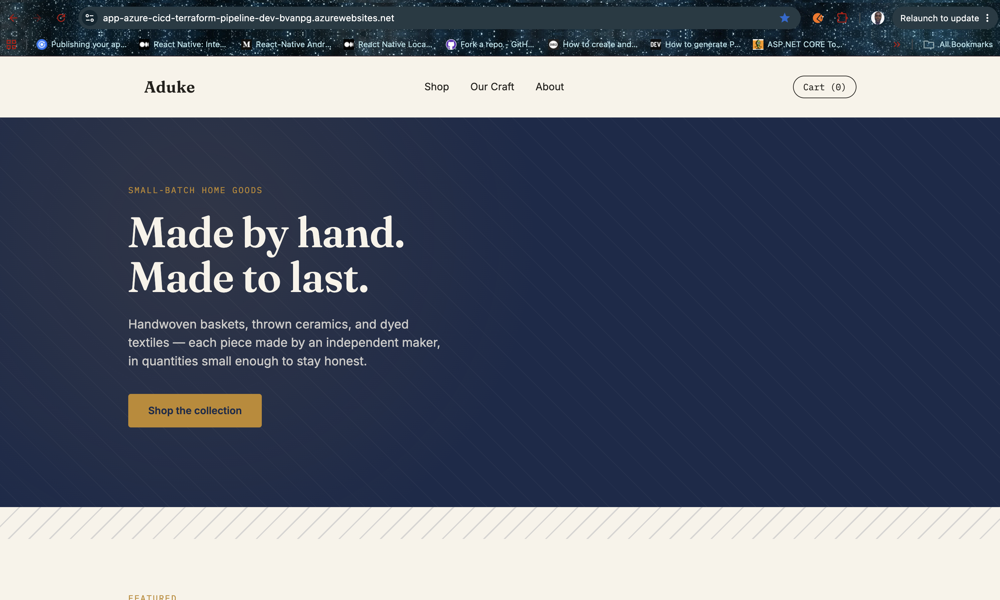
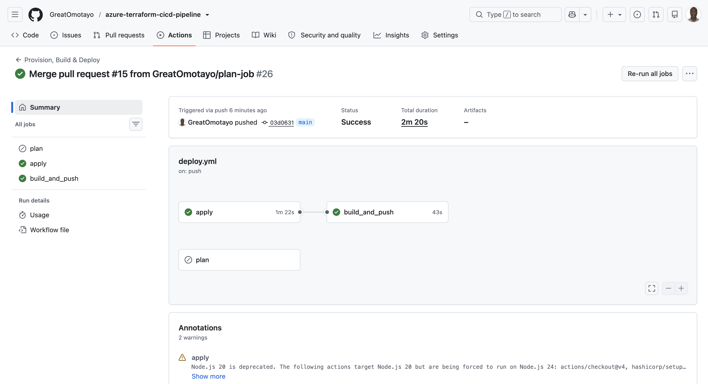
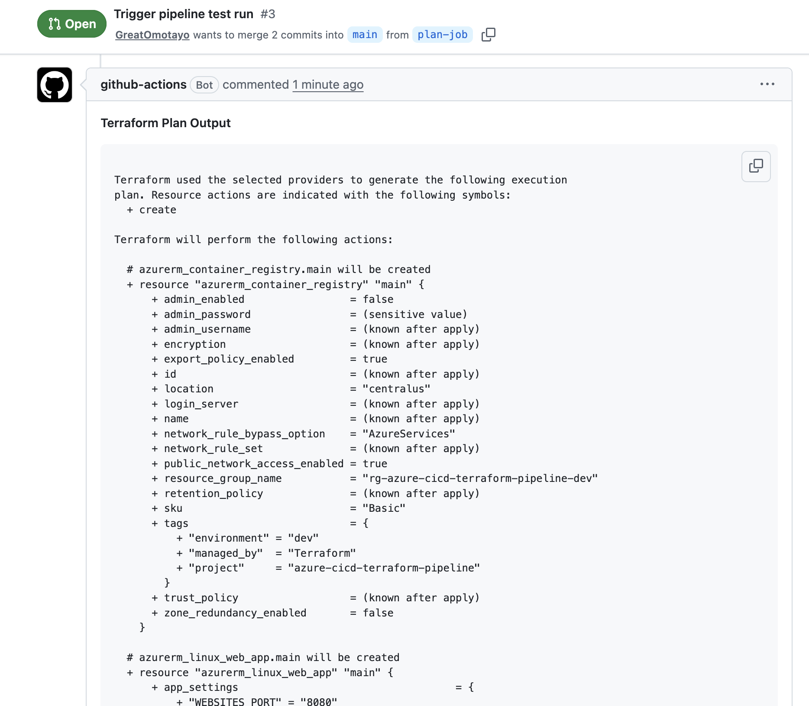
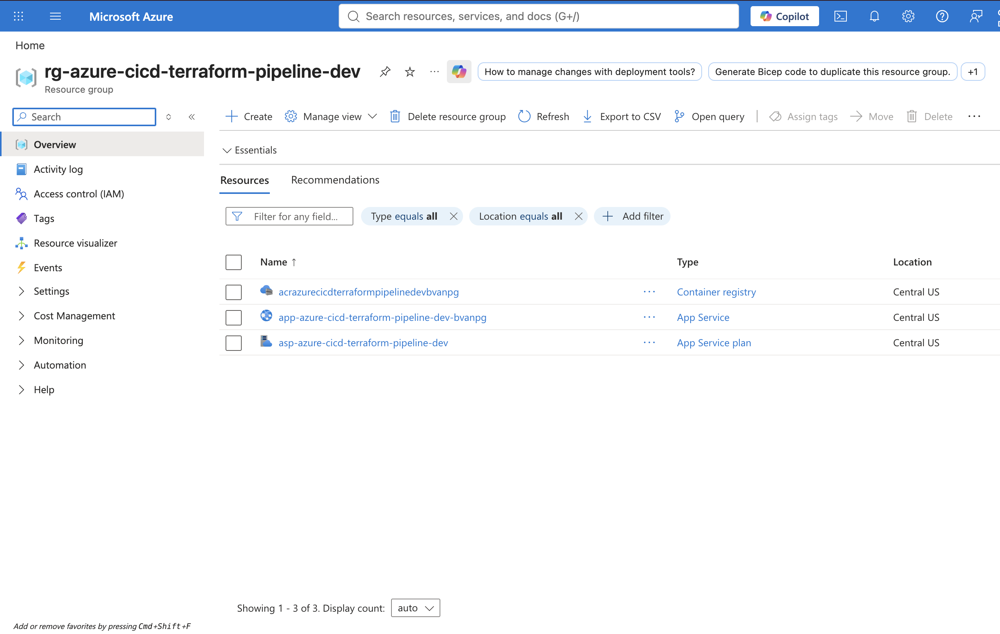

# CI/CD Pipeline for Automated Infrastructure & App Deployment

**Terraform + GitHub Actions + Azure App Service (Containers) + Azure Container Registry**

An end-to-end automated pipeline that provisions Azure infrastructure, builds a Docker image, pushes it to a private registry, and deploys it live — entirely through code and version-controlled workflows, with a documented rollback path.

This project demonstrates the core discipline that separates a "cloud engineer who can click around the portal" from one who can build repeatable, reviewable, production-realistic delivery pipelines — the actual skill set behind the Azure Administrator / Cloud Engineer title.



---

## Table of Contents

- [What This Project Does](#what-this-project-does)
- [Live Demo](#live-demo)
- [Architecture](#architecture)
- [Tech Stack & Why](#tech-stack--why)
- [Repository Structure](#repository-structure)
- [Key Design Decisions & Trade-offs](#key-design-decisions--trade-offs)
- [How to Run / Reproduce](#how-to-run--reproduce)
- [Rollback](#rollback)
- [Security Notes](#security-notes)
- [Real-World Troubleshooting Log](#real-world-troubleshooting-log)
- [Known Limitations & Roadmap](#known-limitations--roadmap)
- [What This Project Demonstrates](#what-this-project-demonstrates)

---

## What This Project Does

On every pull request that touches infrastructure or application code, GitHub Actions runs `terraform plan` and posts the exact infrastructure diff as a PR comment — so a reviewer sees precisely what will change before anything is touched.

On merge to `main` (or on manual trigger, for rollback — see below), GitHub Actions automatically:
1. Runs `terraform apply`, provisioning a resource group, an Azure App Service Plan (Linux), an Azure Container Registry, and an Azure App Service configured to run a container image
2. Builds a Docker image from the application source, tagged with the triggering Git commit SHA
3. Pushes that image to the private Azure Container Registry
4. Restarts the App Service so it pulls and runs the newly pushed image

GitHub Actions authenticates to Azure via OIDC (Workload Identity Federation) — short-lived tokens trusted only from this specific repository and branch, with no static secret stored anywhere. The App Service itself authenticates to the Container Registry using its own Managed Identity. Terraform state is stored remotely in an Azure Storage Account, which is what makes it safe to run this pipeline from a disposable, ephemeral GitHub-hosted runner in the first place.

The deployed app is **Aduke** — a small artisan home-goods landing page, built as a real (if minimal) application rather than a placeholder response, to prove the pipeline deploys something a stakeholder could actually look at.

---

## Live Demo

The infrastructure for this project is provisioned on demand via the pipeline described below, rather than kept running continuously, to avoid unnecessary Azure costs for a portfolio project. The screenshot below shows the deployed app from the most recent successful pipeline run.


To see it live: run `terraform apply` (or trigger the pipeline via a merge to `main`) — the app will be provisioned and reachable within a few minutes at the hostname returned by:

```bash
terraform output app_service_default_hostname
```

---

## Architecture

```
Developer                GitHub                                   Azure
    |                        |                                         |
    |-- opens PR ----------->|                                         |
    |                        |-- runs `terraform plan` -------------->|
    |                        |<-- plan diff -----------------------------|
    |                        |-- posts plan as PR comment              |
    |<-- reviews diff --------|                                         |
    |-- merges to main ----->|                                         |
    |          (or manually  |                                         |
    |           triggers a   |                                         |
    |           rollback)    |                                         |
    |                        |-- [job: apply]                          |
    |                        |     terraform apply -var image_tag=SHA->|
    |                        |                                   (creates/updates
    |                        |                                    Resource Group,
    |                        |                                    App Service Plan,
    |                        |                                    Container Registry,
    |                        |                                    Linux Web App
    |                        |                                    configured for
    |                        |                                    that image tag)
    |                        |<-- reads ACR + App Service outputs -----|
    |                        |-- [job: build_and_push, needs: apply]  |
    |                        |     az acr login                       |
    |                        |     docker build + push (tag = SHA) -->|
    |                        |     az webapp restart ----------------->|
    |<-- live app URL ---------|                                         |
```





---

## Tech Stack & Why

| Tool | Role | Why chosen over alternatives |
|---|---|---|
| **Terraform** | Infrastructure as Code | Cloud-agnostic (vs. Bicep, which is Azure-only) — larger job-market recognition, transferable to AWS/GCP |
| **GitHub Actions** | CI/CD orchestration | Native to GitHub, no separate CI system to maintain |
| **Docker** | Application packaging | Decouples the app from the host runtime — the same image runs identically anywhere |
| **Azure Container Registry (ACR)** | Private image registry | Stays inside the same subscription/identity model as everything else, rather than introducing a second vendor and credential set |
| **Azure App Service (Linux, container mode)** | App hosting (PaaS) | Right abstraction level to demonstrate a deployment pipeline — avoids burying the pipeline story under full container-orchestration complexity (AKS), while still demonstrating real containerization |
| **Managed Identity** | App Service → ACR authentication | Azure-to-Azure authentication with zero static credentials |
| **OIDC / Workload Identity Federation** | GitHub Actions → Azure authentication | Short-lived, narrowly-scoped tokens instead of a stored client secret |
| **Azure Storage Account** | Remote Terraform state | Required for CI-driven Terraform — a disposable GitHub runner has no persistent disk to hold local state between runs |

---

## Repository Structure

```
azure-cicd-terraform-pipeline/
├── .github/
│   └── workflows/
│       └── deploy.yml          # CI/CD pipeline: plan on PR; apply + build_and_push on merge or manual dispatch
├── app/
│   ├── Dockerfile               # Multi-stage build for the Node/Express app
│   ├── package.json
│   ├── server.js                 # Express server: serves static landing page + /health check
│   └── public/
│       └── index.html            # Aduke landing page (deployed artifact)
├── terraform/
│   ├── providers.tf              # Provider + backend declarations, OIDC enabled
│   ├── variables.tf              # Input variables (region, naming, SKU, image tag)
│   ├── main.tf                    # Resource group, Service Plan, ACR, container Web App, role assignment
│   └── outputs.tf                 # Values exposed for the pipeline and for humans
├── docs/
│   └── screenshots/
│       ├── live-app.png
│       ├── github-actions-success.png
│       ├── pr-plan-comment.png
│       ├── azure-portal-resources.png
│       └── terraform-output.png
├── .gitignore
└── README.md
```

---

## Key Design Decisions & Trade-offs

Documented deliberately — this is the part meant to demonstrate engineering judgment, not just tool familiarity. Every choice below has a rejected alternative next to it.

### 1. Terraform over Bicep
Bicep is Azure-native with tighter first-party integration, but locks the skill to a single cloud provider. Terraform's provider model transfers across clouds and is the more commonly requested skill across cloud engineer job postings.

### 2. Three-job pipeline (`plan` on PR; `apply` + `build_and_push` on merge or manual dispatch)
The single most important safety pattern in infrastructure automation is a human review gate before changes go live. `terraform plan` output is posted directly to the PR so a reviewer sees the exact diff before merging; `apply` and the image build/push only fire after that human decision — or a deliberate manual trigger, in the rollback case.

### 3. Containerized deployment (Docker + ACR) over direct code deployment
Packaging the app as a container image decouples it fully from the host's runtime environment, produces an artifact that's immutable and versionable by tag, and reflects the more transferable, senior-level skill set expected of a cloud engineer.

### 4. Multi-stage Dockerfile
Separates the dependency-install stage from the final runtime image, keeping the final image free of anything specific to the build process. Kept as the structurally correct pattern even for this app's simple build, since it's ready to absorb a real compile/bundle step later without rework.

### 5. `node:20-lts-alpine` base image
Roughly 6-8x smaller than the default Debian-based Node image, meaning faster registry pushes/pulls and a smaller attack surface. Trade-off: Alpine's `musl` libc can occasionally clash with native Node modules expecting `glibc` — a non-issue here since `express` has no native bindings.

### 6. ACR with `admin_enabled = false`, authenticated via Managed Identity
Disables the registry's static admin username/password entirely. The App Service authenticates to ACR using its own System-Assigned Managed Identity, granted only the least-privilege `AcrPull` role, scoped to this one registry — zero static registry credentials exist anywhere in this project.

### 7. Git-SHA image tags, not `latest`
Every build is tagged with its triggering Git commit SHA, making each image uniquely and immutably addressable, and directly traceable back to the exact commit that produced it. This is what makes rollback possible — a `latest` tag would overwrite the only reference to the previous image on every deploy.

### 8. Manual `workflow_dispatch` rollback trigger, with an optional `image_tag` input
A manually triggered workflow run accepts a specific past commit SHA and redeploys that already-built, already-pushed image — no need to revert and re-merge a commit just to roll back. This rolls back the application image only; it does not revert Terraform-managed infrastructure changes, which still require reverting the `.tf` source directly.

### 9. App Service (PaaS, container mode) over raw VMs or Kubernetes (AKS)
- **VMs** would require manually owning OS patching and container runtime installation — showcasing infrastructure babysitting, not automation maturity.
- **AKS** is the right tool for a dedicated container-orchestration project, but would bury this project's actual point (pipeline mechanics) under cluster-management complexity — a natural, separate future portfolio project rather than something bolted on here.
- **App Service in container mode** adds genuine containerization experience while keeping the spotlight on CI/CD mechanics.

### 10. OIDC (Workload Identity Federation) for GitHub Actions → Azure authentication
GitHub Actions authenticates using short-lived tokens, trusted by Azure AD only when they originate from this specific repository and branch (or pull-request context) via a federated credential — no client secret is stored in GitHub at all. The App Service's connection to ACR uses a separate mechanism, Managed Identity, since it's a genuine Azure resource and can use it directly; GitHub Actions, being external to Azure, uses OIDC instead. Two different trust models, each used where it actually applies.

### 11. Service Principal scoped to subscription-level `Contributor`, not `Owner`
`Contributor` can create/modify/delete resources but cannot manage RBAC/permissions. Subscription-level scope (rather than a single resource group) is necessary because Terraform's own `azurerm_resource_group` resource creates the resource group itself.

### 12. `User Access Administrator` added alongside `Contributor`, scoped to the specific gap that required it
`Contributor` deliberately excludes `Microsoft.Authorization/roleAssignments/write` — it can manage resources but not who has access to them. This project's Terraform config includes one resource that needs exactly that permission: `azurerm_role_assignment.acr_pull`, which grants the App Service's Managed Identity the `AcrPull` role on the Container Registry. Rather than escalating the Service Principal to `Owner` (which would grant broad governance permissions this project has no reason to touch), `User Access Administrator` was added as a second, narrowly-scoped role — giving the Service Principal precisely "manage resources" plus "manage access to resources it creates," and nothing more.

### 13. Single Azure subscription with per-environment resource groups
At enterprise scale, subscription-per-environment (or a full Management Group hierarchy with Azure Policy guardrails) is the stronger pattern. For this project's scope, that overhead isn't justified; resource-group-level separation is the pragmatic middle ground most small-to-mid teams use before graduating to full subscription isolation.

### 14. Remote state bootstrapped via a one-time Azure CLI script
Using Terraform to provision the very storage account Terraform needs for its own state creates a circular dependency. A one-time CLI script is the documented Microsoft-recommended pattern for this exact bootstrapping problem, rather than maintaining a second, separate Terraform configuration just for this.

### 15. `.terraform.lock.hcl` is committed; `.terraform/` and `*.tfstate` are not
The lock file pins exact provider versions/checksums so every environment resolves identical provider builds. The `.terraform/` cache and state files are either fully regenerable or actively sensitive, so they're excluded.

### 16. Landing page as a real, designed application
The deployed app (Aduke, an artisan home-goods concept) is a genuine small landing page rather than a bare placeholder response — proof the pipeline ships something presentable, not just mechanically functional.

---

## How to Run / Reproduce

### Prerequisites
- An Azure subscription with available compute quota in your target region
- Docker installed locally (for testing image builds before pushing)
- Azure CLI installed and authenticated (`az login`)
- Terraform >= 1.5.0 installed locally
- A GitHub repository with Actions enabled

### 1. Bootstrap the remote state backend (one-time, manual)

```bash
RESOURCE_GROUP="rg-tfstate"
STORAGE_ACCOUNT="sttfstatecicd<yourrandomsuffix>"
CONTAINER_NAME="tfstate"
LOCATION="eastus"

az group create --name $RESOURCE_GROUP --location $LOCATION

az storage account create \
  --name $STORAGE_ACCOUNT \
  --resource-group $RESOURCE_GROUP \
  --location $LOCATION \
  --sku Standard_LRS \
  --encryption-services blob

az storage container create \
  --name $CONTAINER_NAME \
  --account-name $STORAGE_ACCOUNT
```

### 2. Create an app registration and Service Principal for GitHub Actions

```bash
az ad sp create-for-rbac \
  --name "sp-cicd-demo-github" \
  --role "Contributor" \
  --scopes /subscriptions/<YOUR_SUBSCRIPTION_ID>
```

Grant an additional role needed specifically for the ACR pull role assignment this project's Terraform config creates — `Contributor` alone cannot manage RBAC:

```bash
az role assignment create \
  --assignee <YOUR_APP_CLIENT_ID> \
  --role "User Access Administrator" \
  --scope /subscriptions/<YOUR_SUBSCRIPTION_ID>
```

### 3. Configure OIDC federated credentials

```bash
az ad app federated-credential create \
  --id <YOUR_APP_CLIENT_ID> \
  --parameters '{
    "name": "github-actions-main",
    "issuer": "https://token.actions.githubusercontent.com",
    "subject": "repo:<your-github-username>/azure-cicd-terraform-pipeline:ref:refs/heads/main",
    "audiences": ["api://AzureADTokenExchange"]
  }'

az ad app federated-credential create \
  --id <YOUR_APP_CLIENT_ID> \
  --parameters '{
    "name": "github-actions-pull-request",
    "issuer": "https://token.actions.githubusercontent.com",
    "subject": "repo:<your-github-username>/azure-cicd-terraform-pipeline:pull_request",
    "audiences": ["api://AzureADTokenExchange"]
  }'
```

### 4. Add GitHub repository secrets and variables

Under **Settings → Secrets and variables → Actions → Secrets**:

| Secret name | Value |
|---|---|
| `AZURE_CLIENT_ID` | The app registration's client ID |
| `AZURE_SUBSCRIPTION_ID` | Your Azure subscription ID |
| `AZURE_TENANT_ID` | Your Azure AD tenant ID |
| `TF_STATE_STORAGE_ACCOUNT` | The storage account name from Step 1 |

Under **Settings → Secrets and variables → Actions → Variables**:

| Variable name | Value |
|---|---|
| `PROJECT_NAME` | `cicd-demo` |

### 5. Open a pull request

Modify anything under `terraform/` or `app/`, push a branch, and open a PR against `main`. GitHub Actions runs `terraform plan` and posts the diff as a PR comment.

### 6. Merge to `main`

On merge, GitHub Actions runs `terraform apply` (provisioning infrastructure, including the ACR), then `build_and_push` (building, tagging with the commit SHA, and pushing the Docker image, then restarting the App Service). The live app URL is available via:

```bash
terraform output app_service_default_hostname
```

### 7. Tear down (avoid ongoing Azure charges)

```bash
cd terraform
terraform init \
  -backend-config="storage_account_name=<your storage account>" \
  -backend-config="resource_group_name=rg-tfstate" \
  -backend-config="container_name=tfstate" \
  -backend-config="key=cicd-demo.dev.tfstate"
terraform destroy
```

---

## Rollback

Because every image is tagged with its Git commit SHA and never overwritten, rolling back is a matter of redeploying a previous, still-existing image tag — not reverting code.

1. Find the SHA of the last known-good commit: `git log --oneline`
2. In GitHub, go to **Actions → Terraform CI/CD → Run workflow**
3. Enter that SHA in the `image_tag` input field
4. Run it — `apply` updates the App Service to reference that tag, `build_and_push` re-confirms/pushes it, and the App Service restarts to pull it

**Limitation:** this rolls back the application image only. If a later commit also changed Terraform-managed infrastructure, that infrastructure change is not automatically reverted — the corresponding `.tf` changes would need to be reverted separately in Git.

---

## Security Notes

- No credentials are ever committed to this repository. GitHub Actions authenticates to Azure via OIDC/Workload Identity Federation — short-lived tokens trusted only from this specific repo and branch (or pull-request context), with no static client secret stored anywhere.
- The App Service authenticates to the Container Registry via its own Managed Identity — no static registry credentials exist anywhere in this project (`admin_enabled = false` on the ACR).
- Terraform state is stored remotely and encrypted at rest in Azure Blob Storage.
- The Service Principal is scoped to `Contributor` (not `Owner`); the App Service's Managed Identity is scoped to `AcrPull` only (read-only image pull) on just the one registry it needs.
- `terraform apply` only runs after a human-reviewed merge to `main`, or a deliberate manual rollback trigger — never on an arbitrary push.
- OIDC trust is intentionally restricted to `main` and pull-request contexts; a `workflow_dispatch` run against any other branch is denied by design, not by oversight.



---

## Real-World Troubleshooting Log

Kept intentionally, since debugging real infrastructure problems is as much a part of the job as writing the code — and a stronger interview story than a project that "just worked."

**Invalid workflow file — `Unexpected value 'outputs'`**
Cause: the `outputs:` block was indented at the wrong YAML nesting level. Fix: aligned with other job-level keys (`if:`, `runs-on:`, `steps:`), not nested under `steps:`.

**Actions run showed only the `plan` job, `apply` missing entirely**
Cause: the `apply` job had been accidentally dropped from the workflow file during an earlier edit. Fix: re-added as a sibling of `plan:` under `jobs:`.

**Workflow file edits silently didn't trigger a run**
Cause: the `paths:` filter scopes triggers to `terraform/**` and `app/**` — edits outside those paths correctly don't trigger a run; the filter working as designed.

**`terraform init` — `Failed to read file: the file "key-cicd-demo.dev.tfstate" could not be read`**
Cause: a mistyped `-backend-config` flag (a hyphen where an `=` should have been) caused Terraform to treat the whole string as a literal filename. Fix: retyped the command carefully, confirming exact `key=` syntax.

**`terraform apply` — `401 Unauthorized: quota Current Limit (Total VMs): 0`**
Cause: the target region had a 0 vCPU quota for VM-backed compute, affecting Linux App Service Plans across every SKU tier. Fix: confirmed quota availability in an alternate region and updated the `location` variable — a real example of infrastructure decisions being shaped by platform constraints, not just architecture preference.

**Known, proactively-flagged provider quirk:** the `azurerm` Terraform provider has a documented rough edge where Managed Identity-based ACR pull configuration doesn't always reliably trigger on the very first `apply`, occasionally requiring a manual confirmation in the Azure Portal's Deployment Center blade. Flagged here as a known tooling limitation, not a configuration mistake.

**`terraform apply` — `403 AuthorizationFailed` on `azurerm_role_assignment.acr_pull`**
Cause: the Service Principal's `Contributor` role explicitly excludes `Microsoft.Authorization/roleAssignments/write` — it can manage resources but not grant roles to other identities, which is exactly what the ACR pull role assignment requires. Fix: added `User Access Administrator` as a second, narrowly-scoped role on the same Service Principal, rather than escalating to `Owner`.

**OIDC — `AADSTS700213: No matching federated identity record found`**
Cause: GitHub's OIDC subject claim included a numeric account/repo ID suffix (`repo:owner@12345/repo@67890:ref:...`) not originally present in the configured federated credential's subject — a documented GitHub behavior that appears for newly created or recently renamed repositories, as a safeguard against name-based impersonation. A separate, unrelated typo (`refs/head/main` instead of `refs/heads/main`) compounded the same error on a second attempt. Fix: updated the federated credential's subject to match exactly what GitHub was presenting, confirmed via `az ad app federated-credential list`.

**PR comment step — `ReferenceError: azurerm_container_registry is not defined`**
Cause: the "Comment plan on PR" step interpolated the raw Terraform plan output (`${{ steps.plan.outputs.stdout }}`) directly inside a JavaScript template literal (backtick string) in the `actions/github-script` step. Since the plan output contained a `${...}`-shaped sequence (a resource address reference), JavaScript's own template-literal parser interpreted it as real code to evaluate, rather than inert text — attempting to look up a non-existent variable. Fix: passed the plan output through the step's `env:` block instead (`PLAN: "${{ steps.plan.outputs.stdout }}"`) and read it in the script via `process.env.PLAN`, keeping it as safe string data regardless of its contents.

**`build_and_push` job — `Error: Output "app_service_name" not found`**
Cause: the `build_and_push` job attempted to read Terraform outputs without first running `terraform init` in that job. Every GitHub Actions job runs on a completely fresh, isolated runner with no shared filesystem state from other jobs — so a job that only *reads* Terraform outputs still needs its own `init` step against the remote backend, exactly like the jobs that run `plan` or `apply`. Fix: added the same `Setup Terraform` and `Terraform Init` steps used in `plan`/`apply` to `build_and_push`, before the step that reads outputs.

---

## Known Limitations & Roadmap

Documented honestly — these are deliberate scope boundaries, not oversights:

- [ ] **Full end-to-end verification screenshots** to be added once the current pipeline configuration completes a live run.
- [ ] **Add a `workflow_dispatch` ref/branch guard** — the OIDC federated credential scoping means a manual run against a branch other than `main` will fail authentication by design, but an explicit guard in the workflow itself would make this intentional rather than incidental.
- [ ] **Refactor duplicated `terraform init` logic** (repeated across `plan` and `apply`) into a reusable composite action.
- [ ] **De-duplicate PR plan comments** — currently every push to a PR posts a new comment rather than updating an existing one.
- [ ] **Evaluate subscription-per-environment or Management Group hierarchy** if extended to a real multi-team, multi-environment setup.
- [ ] Add `staging` and `prod` environments via separate `.tfvars` files and separate state keys.
- [ ] Add a post-deploy health check step (curl `/health`) to `build_and_push`, verifying the container actually responds correctly after the restart, rather than assuming success.
- [ ] Add semantic version tags alongside the Git SHA tag, for more human-readable release tracking.

---

## What This Project Demonstrates

Built as a hands-on exploration of the core discipline behind modern cloud delivery: not just "can I create a resource in Azure," but "can I build a pipeline that provisions, containerizes, deploys, and rolls back safely and repeatably, with a human review gate and least-privilege authentication baked in throughout." Every architectural choice above was made deliberately, with a documented alternative considered and rejected, and every real-world blocker encountered along the way is logged rather than hidden — the goal being to demonstrate engineering judgment and troubleshooting ability, not just tool familiarity.
